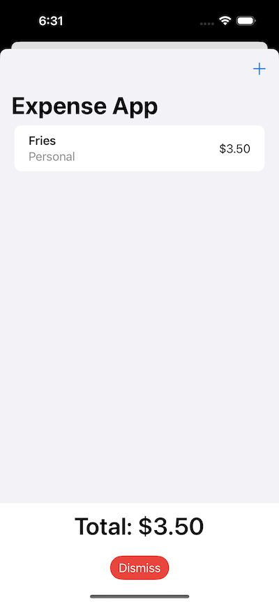

#  Summary
Its an expense app/ sandbox of the following topics. It explores adding multiple views as structs and sheets, creating user objects, default settings and saves. Objects contain UUID

### Topics
- new views
- User data
- Objects
- .onDelete
- User Defaults
- Identifiers

### Screenshots:

